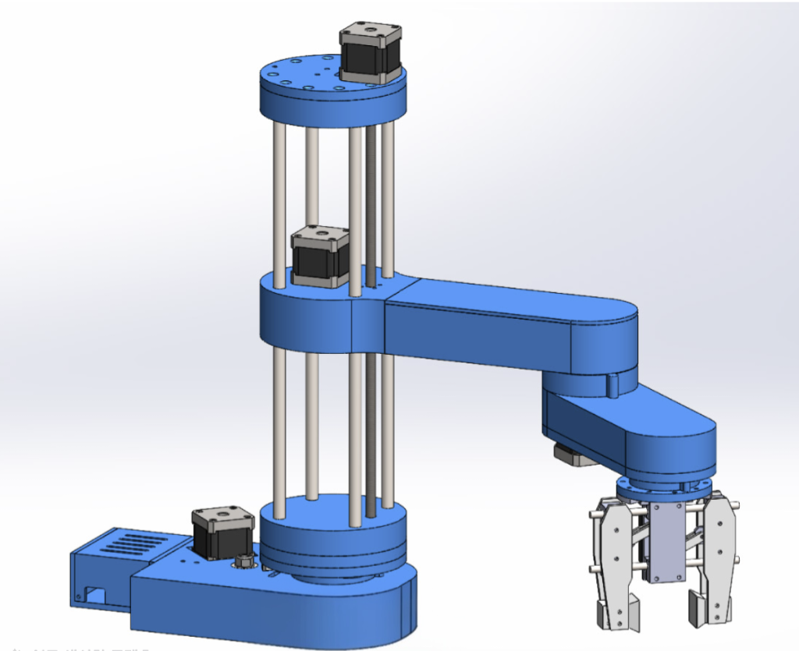

# SCARA 납땜 보조 로봇 — 트러블슈팅 & 리스크 분석

> **프로젝트 개요**  
> 카메라 화면에서 납땜 위치를 클릭하면 SCARA 로봇이 인두기를 자동 이동시키는 소형 책상용 납땜 보조 장치.  
> MCU: nRF54L15(NU54V-DK) / 구동: NEMA17 ×2 + LM-NK112810H ×1 / 드라이버: TMC2209 ×3

---

## 📎 레퍼런스

### SCARA Robot — HowToMechatronics

> 아두이노 기반 SCARA 로봇 제작 가이드. 기구 구조, 역기구학, 모터 제어, 3D 프린트 파일 포함.  
> **링크**: [https://howtomechatronics.com/projects/scara-robot-how-to-build-your-own-arduino-based-robot/](https://howtomechatronics.com/projects/scara-robot-how-to-build-your-own-arduino-based-robot/)

---

## BOM 요약

| 부품명 | 수량 | 주요 스펙 | 단가 |
|---|---|---|---|
| NU54V-DK (nRF54L15) | 1 | BLE 6.0, RISC-V, 1.5 MB Flash | 보유 |
| NEMA17 (스텝모터) | 2 | 홀딩토크 0.45 N·m, 정격전류 1.68 A, 축 5 mm D컷 | 당근 개당 ≈5,000원 |
| LM-NK112810H (리니어모터) | 1 | 홀딩토크 0.08 N·m, 정격전류 1.0 A, 리드 2 mm | 보유 |
| TMC2209 (모터드라이버) | 3 | 입력 4.75–29 V, 출력 2 A(rms) | 3개 7,720원 |
| 풀리+타이밍벨트 세트1 | 1 | 20T+80T, Bore 5 mm, 둘레 200 mm | 5,000원 |
| 풀리+타이밍벨트 세트2 | 1 | 20T+80T, Bore 5 mm, 둘레 600 mm | 10,650원 |
| 베어링 | 4 | TBD | TBD |
| 샤프트 | 4 | 8 mm × 250 mm | 개당 2,940원 |
| 어댑터+파워코드 | 1 | DC 24 V / 10 A / 240 W | 32,000원 |
| 전원분배기 | 1 | TBD | TBD |
| 볼트·너트 | A/R | TBD | TBD |

---

## 식별된 리스크 및 막힐 지점

### ① 부품 사양·기구 성능 (BOM, 모터 스펙, 작업 영역/하중)

**문제점**  
모터 스펙이 실제 요구 토크를 감당하는지 감각이 없다.

**구체적 확인 방법**
- 링크 길이(예: 각 암 150 mm)와 인두기 무게(≈200 g)를 가정해  
  필요 토크 = `F × L = 0.2 kg × 9.81 m/s² × 0.15 m ≈ 0.29 N·m` 계산 → NEMA17(0.45 N·m)은 안전율 약 1.5배로 통과.  
  단, 두 링크가 겹쳐 최대 팔 뻗을 때는 0.45 N·m에 근접하므로 **감속비(20T→80T = 4:1)가 반드시 적용된 상태**인지 확인.
- 리니어모터(Z축)는 홀딩토크 0.08 N·m, 리드 2 mm → 수직 하중 감당 가능 여부를 `F = T × 2π / lead = 0.08 × 2π / 0.002 ≈ 251 N`으로 환산해 실하중과 비교.
- 전자부품 호환: TMC2209 입력 최대 29 V → 24 V 전원에서 정상. 단 MCU(NU54V-DK)는 3.3 V 레귤레이터 별도 필요.
- 당근 중고 NEMA17의 실제 스펙 시트를 판매자에게 받거나, 모델명으로 직접 검색해 보유 스펙과 일치 확인.

---

### ② 위치 정확도·좌표 연결 (모터 제어, 카메라 ↔ 로봇 좌표)

**문제점**  
카메라 좌표 → 로봇 좌표 변환 경험 없음. 모터 오차 누적도 우려.

**구체적 확인 방법**
- SCARA 역기구학(IK) 공식을 먼저 수식으로 검증하고, 코드 작성 전 Python 시뮬레이션으로 확인.
- 스텝 해상도: NEMA17 200스텝/rev + 4:1 감속 + 1/16 마이크로스텝 → 회전당 12,800 스텝 → 링크 150 mm 기준 최소 이동단위 ≈ 0.07 mm.
- 카메라 캘리브레이션: OpenCV `calibrateCamera`로 내부 파라미터(왜곡 계수 포함) 추출 후, 체크보드 기준점 4–6개로 **호모그래피 행렬** 계산해 픽셀 ↔ mm 변환.
- 단계적 검증: ① 모터 단독 이동 오차 측정 → ② IK 단독 검증 → ③ 카메라 변환 단독 검증 → ④ 통합 테스트.

---

### ③ 일정 지연 (부품 조달, 기구설계, 2개월 솔로 프로젝트)

**문제점**  
알리익스프레스 배송 2–4주, 기구설계 숙련도 부족, 중간고사 일정 충돌.

**구체적 확인 방법**
- BOM을 멘토님께 검토받고 **즉시 주문** (알리 배송 리드타임 최우선 고려).
- 기구설계와 코드 작업을 병렬 진행: 부품 도착 전 역기구학·모터 제어 코드 PC에서 먼저 작성.
- 마일스톤 설정 (예시):
  | 주차 | 목표 |
  |---|---|
  | 1–2주 | 부품 주문 완료, IK 수식 검증, 기구 개념설계 |
  | 3–4주 | CAD 1차 설계, 알리 부품 도착 예상 |
  | 5–6주 | 3D 프린트 출력, 모터 단독 테스트 |
  | 7–8주 | 통합 조립, 카메라 캘리브레이션, 시스템 테스트 |

---

### ④ 3D 프린팅 접근성 (학교 시설, 주말 미운영)

**문제점**  
학교 3D 프린터를 주중에만 사용 가능하고 출력 후 다음날 수거 방식이라 반복 수정이 매우 느리다.

**추가로 파악된 세부 문제**
- **설계 수정 반복 비용**: 기구 설계가 잘못되면 재출력까지 2일 이상 소요. 링크 1개당 출력 시간 3–6시간 가정 시, 전체 출력물이 10개 이상이면 프린팅만 2–3주 걸릴 수 있음.
- **출력 실패 위험**: 서포트 제거 불량, 뒤틀림, 레이어 분리 등으로 재출력 발생 확률 높음.
- **치수 정밀도**: FDM 프린터는 ±0.3–0.5 mm 공차가 일반적. 베어링 압입 구멍, 모터 마운트 구멍 등 치수 공차가 중요한 부위는 **여유치 계산 후 설계**하고, 최초 출력 시 테스트용 소형 샘플(링·구멍만 있는 칩)을 먼저 출력해 공차 확인.

**대응 방안**
- 출력 예약을 최대한 묶어서 하는 설계 전략(모든 부품을 동시에 출력할 수 있도록 CAD 완성 후 한 번에 제출).
- 대안: 외부 3D 프린팅 서비스(메이커스페이스, 온라인 출력 서비스) 활용 검토. 납기 2–3일이지만 주말 무관.
- 핵심 치수 부위(베어링 시트, 모터 마운트)는 금속 부품(알루미늄 프로파일, 레이저컷)으로 대체 가능 여부 검토.

---

### ⑤ 열 관리 (납땜 인두기 열·연기)

**문제점**  
인두기 팁 온도 300–400°C. 로봇 암과 케이블이 열에 노출됨.

**구체적 확인 방법**
- 3D 프린트 소재: PLA는 60°C에서 변형 시작 → **PETG(80°C) 또는 ABS(100°C) 이상** 소재 사용 권장, 특히 엔드 이펙터(인두기 홀더) 주변.
- 인두기 마운트에 세라믹 단열재 또는 알루미늄 방열판 삽입 고려.
- 케이블(모터선, 신호선)을 인두기 열원에서 최소 30 mm 이상 이격 배선.
- 납땜 흄(연기)이 카메라 렌즈에 달라붙으면 영상 품질 저하 → 카메라 위치는 연기 흐름 방향을 고려해 배치하거나 팬으로 흄 배출.

---

### ⑥ MCU 실시간 제어 능력 (nRF54L15, BLE 통신 지연)

**문제점**  
nRF54L15는 BLE 6.0 MCU로, BLE 통신의 연결 지연이 실시간 모터 제어에 영향을 줄 수 있음.

**구체적 확인 방법**
- BLE 연결 간격(Connection Interval)을 최소(7.5 ms)로 설정해 지연 최소화. 단 이 경우 전력 소비 증가.
- 대안: 카메라 PC에서 좌표 계산 후 **USB UART**로 nRF54L15에 명령 전달 → BLE 없이도 동작 가능하도록 설계. BLE는 모니터링용으로만 사용.
- nRF54L15의 128 MHz RISC-V 코어로 TMC2209 UART 제어(스텝 펄스 생성)가 가능한지, Zephyr RTOS 기반 타이밍을 검증.
- TMC2209는 UART 모드에서 속도/전류 명령 가능 → 스텝 펄스 직접 생성이 불필요해 MCU 부담 감소. UART 통신 핀 수 절약.

---

### ⑦ 전원 분배 설계 미완성

**문제점**  
전원분배기가 TBD 상태. 24 V에서 모터 드라이버(3개), MCU(3.3 V), 카메라(5 V USB)를 동시에 공급해야 함.

**구체적 확인 방법**
- 최대 전류 계산:  
  - NEMA17 × 2: 최대 1.68 A × 2 = 3.36 A  
  - 리니어모터 × 1: 최대 1.0 A  
  - MCU + 기타: ≈0.5 A  
  - **합계 ≈ 4.86 A** → 10 A 파워서플라이로 여유 있음.
- 전원분배기 대신 **터미널 블록** + 개별 배선으로 단순화 가능.
- 24 V → 3.3 V: LDO보다 **벅컨버터 모듈(24 V→5 V→3.3 V)** 사용 권장 (전압차가 크므로 LDO 발열 심함).
- 인두기 전원(AC 220 V)은 별도 콘센트에서 분리 공급 (로봇 전원과 완전 분리).

---

### ⑧ 홈 포지션·리밋 스위치 미설계

**문제점**  
스텝모터는 위치 피드백이 없어 **전원 ON 시 로봇이 자신의 현재 위치를 알 수 없음**. 매번 하드웨어 홈으로 복귀하는 루틴이 없으면 충돌 위험.

**구체적 확인 방법**
- 각 조인트(J1, J2)와 Z축에 마이크로스위치 또는 홀 센서를 설치해 **홈 포지션 감지** 구현.
- 전원 ON 시 반드시 홈 시퀀스(homing sequence) 실행 후 작업 시작.
- TMC2209의 StallGuard 기능(무센서 스톨 감지)으로 리밋 스위치 대체 가능 여부 검토.

---

### ⑨ 엔드 이펙터 설계 (인두기 고정 방법)

**문제점**  
인두기를 로봇 암 끝에 어떻게 고정할지 BOM에 없음. 인두기 지름·형태에 따라 클램프 구조 필요.

**구체적 확인 방법**
- 사용할 인두기의 지름 측정 후 클램프 설계.
- 인두기 코드(전선)의 장력이 로봇 암에 영향을 주지 않도록 **케이블 체인** 또는 느슨한 루프 배선 고려.
- 인두기 ON/OFF를 로봇이 제어할 필요가 있으면 릴레이 모듈 추가 필요 (BOM에 없음).

---

### ⑩ 카메라 선정 및 시야각

**문제점**  
카메라 스펙이 BOM에 없음. 해상도·시야각·왜곡이 좌표 변환 정밀도에 직접 영향.

**구체적 확인 방법**
- 작업 영역 크기(예: 200 × 200 mm)와 목표 정밀도(1 mm 이내)를 기준으로 필요 해상도 계산:  
  `최소 해상도 = 200 mm / 1 mm = 200 픽셀` → 720p(1280×720) 이상 권장.
- 광각 렌즈(왜곡 큰)보다 **표준~망원 화각** 카메라 사용이 왜곡 보정 쉬움.
- USB 웹캠(예: C270, C920) 또는 라즈베리파이 카메라 모듈 고려.
- 카메라가 작업 영역 위 정중앙에 수직으로 설치되어야 원근 왜곡 최소화.

---

## 종합 우선순위 체크리스트

| 우선순위 | 항목 | 상태 |
|---|---|---|
| 🔴 즉시 | BOM 멘토님 검토 후 주문 | ⬜ |
| 🔴 즉시 | 전원 분배 설계 (버크컨버터 선정) | ⬜ |
| 🔴 즉시 | 카메라 기종 선정·구매 | ⬜ |
| 🟠 1주 내 | SCARA 역기구학 수식 검증 (Python) | ⬜ |
| 🟠 1주 내 | 홈 포지션 리밋 스위치 설계 반영 | ⬜ |
| 🟠 1주 내 | 엔드 이펙터(인두기 홀더) 구조 확정 | ⬜ |
| 🟡 2주 내 | 3D 프린트 부품 목록 확정 후 일괄 출력 예약 | ⬜ |
| 🟡 2주 내 | TMC2209 UART 제어 코드 PC 테스트 | ⬜ |
| 🟡 2주 내 | 카메라 캘리브레이션 (OpenCV) | ⬜ |
| 🟢 조립 후 | 단계별 정밀도 측정 (모터→IK→카메라 통합) | ⬜ |
| 🟢 조립 후 | 열 관리 실측 (인두기 주변 온도 측정) | ⬜ |

---

*최종 업데이트: 2026-09-30*
